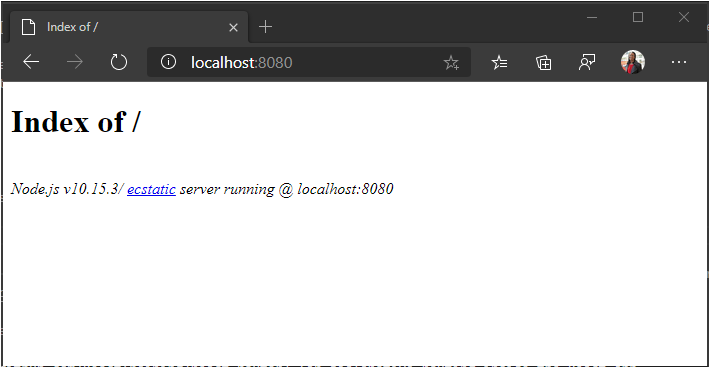
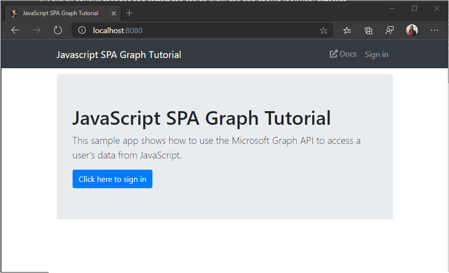

<!-- markdownlint-disable MD002 MD041 -->

Start by creating an empty directory for the project. This can be on an HTTP server, or a directory on your development machine. If it is on your development machine, you'll need to copy it to a server for testing, or run an HTTP server on your development machine. If you don't have either of those, the next section provides instructions.

## Start a local web server (optional)

> [!NOTE]
> The steps in this section require [Node.js](https://nodejs.org).

In this section you will use [http-server](https://www.npmjs.com/package/http-server) to run a simple HTTP server from the command line.

1. Open your command-line interface (CLI) in the directory you created for the project.
1. Run the following command to start a web server in that directory.

    ```Shell
    npx http-server -c-1
    ```

1. Open your browser and browse to `http://localhost:8080`.

You should see an **Index of /** page. This confirms that the HTTP server is running.



## Design the app

In this section you'll create the basic UI layout for the application.

1. Create a new file in the root of the project named **index.html** and add the following code.

    :::code language="html" source="../demo/graph-tutorial/index.html" id="indexSnippet":::

    This defines the basic layout of the app, including a navigation bar. It also adds the following:

    - [Bootstrap](https://getbootstrap.com/) and its supporting JavaScript
    - [FontAwesome](https://fontawesome.com/)
    - [Moment.js](https://momentjs.com/)
    - [Microsoft Authentication Library for JavaScript (MSAL.js) 2.0](https://github.com/AzureAD/microsoft-authentication-library-for-js/tree/dev/lib/msal-browser)
    - [Microsoft Graph JavaScript Client Library](https://github.com/microsoftgraph/msgraph-sdk-javascript)

    > [!TIP]
    > The page includes a favicon, (`<link rel="shortcut icon" href="g-raph.png">`). You can remove this line, or you can download the **g-raph.png** file from [GitHub](https://github.com/microsoftgraph/g-raph).

1. Create a new file named **style.css** and add the following code.

    :::code language="css" source="../demo/graph-tutorial/style.css":::

1. Create a new file named **auth.js** and add the following code.

    ```javascript
    function signIn() {
      // TEMPORARY
      updatePage({name: 'Megan Bowen', userName: 'meganb@contoso.com'});
    }

    function signOut() {
      // TEMPORARY
      updatePage();
    }
    ```

1. Create a new file named **ui.js** and add the following code.

    ```javascript
    // Select DOM elements to work with
    const authenticatedNav = document.getElementById('authenticated-nav');
    const accountNav = document.getElementById('account-nav');
    const mainContainer = document.getElementById('main-container');

    const Views = { error: 1, home: 2, calendar: 3 };

    function createElement(type, className, text) {
      var element = document.createElement(type);
      element.className = className;

      if (text) {
        var textNode = document.createTextNode(text);
        element.appendChild(textNode);
      }

      return element;
    }

    function showAuthenticatedNav(user, view) {
      authenticatedNav.innerHTML = '';

      if (user) {
        // Add Calendar link
        var calendarNav = createElement('li', 'nav-item');

        var calendarLink = createElement('button',
          `btn btn-link nav-link${view === Views.calendar ? ' active' : '' }`,
          'Calendar');
        calendarLink.setAttribute('onclick', 'getEvents();');
        calendarNav.appendChild(calendarLink);

        authenticatedNav.appendChild(calendarNav);
      }
    }

    function showAccountNav(user) {
      accountNav.innerHTML = '';

      if (user) {
        // Show the "signed-in" nav
        accountNav.className = 'nav-item dropdown';

        var dropdown = createElement('a', 'nav-link dropdown-toggle');
        dropdown.setAttribute('data-toggle', 'dropdown');
        dropdown.setAttribute('role', 'button');
        accountNav.appendChild(dropdown);

        var userIcon = createElement('i',
          'far fa-user-circle fa-lg rounded-circle align-self-center');
        userIcon.style.width = '32px';
        dropdown.appendChild(userIcon);

        var menu = createElement('div', 'dropdown-menu dropdown-menu-right');
        dropdown.appendChild(menu);

        var userName = createElement('h5', 'dropdown-item-text mb-0', user.displayName);
        menu.appendChild(userName);

        var userEmail = createElement('p', 'dropdown-item-text text-muted mb-0', user.mail || user.userPrincipalName);
        menu.appendChild(userEmail);

        var divider = createElement('div', 'dropdown-divider');
        menu.appendChild(divider);

        var signOutButton = createElement('button', 'dropdown-item', 'Sign out');
        signOutButton.setAttribute('onclick', 'signOut();');
        menu.appendChild(signOutButton);
      } else {
        // Show a "sign in" button
        accountNav.className = 'nav-item';

        var signInButton = createElement('button', 'btn btn-link nav-link', 'Sign in');
        signInButton.setAttribute('onclick', 'signIn();');
        accountNav.appendChild(signInButton);
      }
    }

    function showWelcomeMessage(user) {
      // Create jumbotron
      var jumbotron = createElement('div', 'jumbotron');

      var heading = createElement('h1', null, 'JavaScript SPA Graph Tutorial');
      jumbotron.appendChild(heading);

      var lead = createElement('p', 'lead',
        'This sample app shows how to use the Microsoft Graph API to access' +
        ' a user\'s data from JavaScript.');
      jumbotron.appendChild(lead);

      if (account) {
        // Welcome the user by name
        var welcomeMessage = createElement('h4', null, `Welcome ${user.displayName}!`);
        jumbotron.appendChild(welcomeMessage);

        var callToAction = createElement('p', null,
          'Use the navigation bar at the top of the page to get started.');
        jumbotron.appendChild(callToAction);
      } else {
        // Show a sign in button in the jumbotron
        var signInButton = createElement('button', 'btn btn-primary btn-large',
          'Click here to sign in');
        signInButton.setAttribute('onclick', 'signIn();')
        jumbotron.appendChild(signInButton);
      }

      mainContainer.innerHTML = '';
      mainContainer.appendChild(jumbotron);
    }

    function showError(error) {
      var alert = createElement('div', 'alert alert-danger');

      var message = createElement('p', 'mb-3', error.message);
      alert.appendChild(message);

      if (error.debug)
      {
        var pre = createElement('pre', 'alert-pre border bg-light p-2');
        alert.appendChild(pre);

        var code = createElement('code', 'text-break text-wrap',
          JSON.stringify(error.debug, null, 2));
        pre.appendChild(code);
      }

      mainContainer.innerHTML = '';
      mainContainer.appendChild(alert);
    }

    function updatePage(view, data) {
      if (!view) {
        view = Views.home;
      }

      const user = JSON.parse(sessionStorage.getItem('graphUser'));

      showAccountNav(user);
      showAuthenticatedNav(user, view);

      switch (view) {
        case Views.error:
          showError(data);
          break;
        case Views.home:
          showWelcomeMessage(user);
          break;
        case Views.calendar:
          break;
      }
    }

    updatePage(Views.home);
    ```

1. Save all of your changes and refresh the page. Now, the app should look very different.

    
