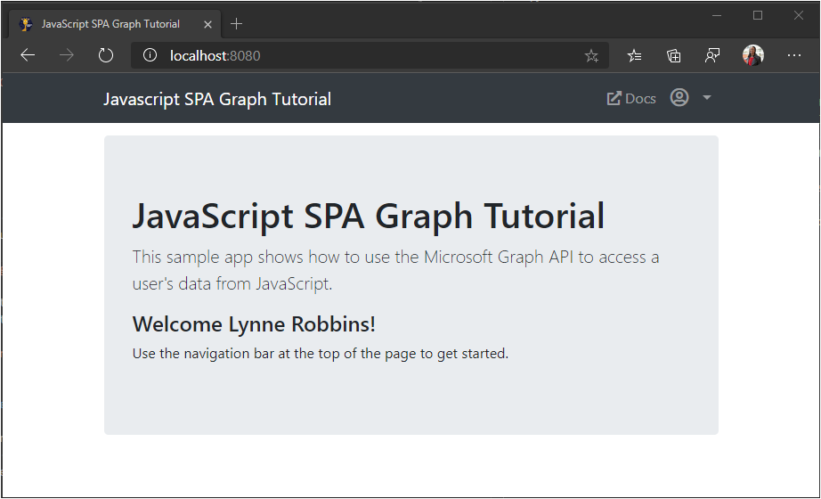
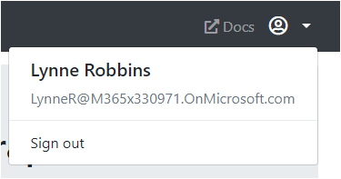

<!-- markdownlint-disable MD002 MD041 -->

In this exercise you will extend the application from the previous exercise to support authentication with Azure AD. This is required to obtain the necessary OAuth access token to call the Microsoft Graph. In this step you will integrate the [Microsoft Authentication Library](https://github.com/AzureAD/microsoft-authentication-library-for-js) library into the application.

1. Create a new file in the root directory named `config.js` and add the following code.

    :::code language="javascript" source="../demo/graph-tutorial/config.js.example" id="msalConfig":::

    Replace `YOUR_APP_ID_HERE` with the application ID from the Application Registration Portal.

    > [!IMPORTANT]
    > If you're using source control such as git, now would be a good time to exclude the `config.js` file from source control to avoid inadvertently leaking your app ID.

1. Open `auth.js` and add the following code to the beginning of the file.

    :::code language="javascript" source="../demo/graph-tutorial/auth.js" id="authInit":::

## Implement sign-in

In this section you'll implement the `signIn` and `signOut` functions.

1. Replace the existing `signIn` function with the following.

    :::code language="javascript" source="../demo/graph-tutorial/auth.js" id="signIn":::

1. Replace the existing `signOut` function with the following.

    :::code language="javascript" source="../demo/graph-tutorial/auth.js" id="signOut":::

1. Save your changes and refresh the page. After you sign in, you should end up back on the home page, but the UI should change to indicate that you are signed-in.

    

1. Click the user avatar in the top right corner to access the **Sign out** link. Clicking **Sign out** resets the session and returns you to the home page.

    

## Storing and refreshing tokens

At this point your application has an access token, which is sent in the `Authorization` header of API calls. This is the token that allows the app to access the Microsoft Graph on the user's behalf.

However, this token is short-lived. The token expires an hour after it is issued. This is where the refresh token becomes useful. The refresh token allows the app to request a new access token without requiring the user to sign in again.

Because the app is using the MSAL library, you do not have to implement any token storage or refresh logic. MSAL caches the token in the browser session. The `acquireTokenSilent` method first checks the cached token, and if it is not expired, it returns it. If it is expired, it uses the cached refresh token to obtain a new one.
