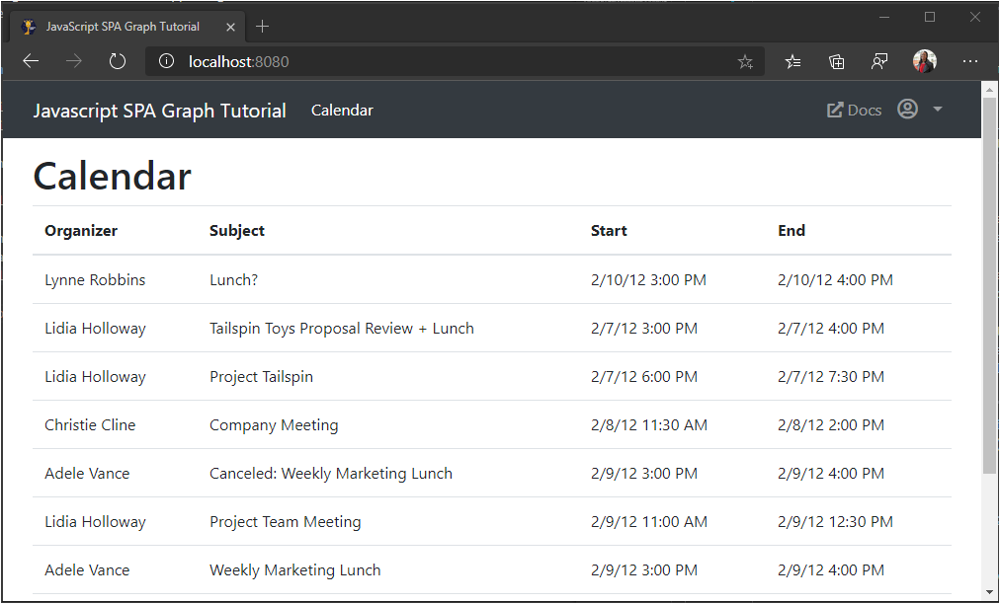

<!-- markdownlint-disable MD002 MD041 -->

In this exercise you will incorporate the Microsoft Graph into the application. For this application, you will use the [Microsoft Graph JavaScript Client Library](https://github.com/microsoftgraph/msgraph-sdk-javascript) library to make calls to Microsoft Graph.

## Create a Graph authentication provider

In this section, you'll implement an authentication provider for the Microsoft Graph client.

Create a new file in the root of the project named `graph.js` and add the following code.

:::code language="javascript" source="../demo/graph-tutorial/graph.js" id="graphInit":::

## Get calendar events from Outlook

In this section, you'll use the Microsoft Graph client library to get calendar events for the user.

1. Add the following function to `graph.js`.

    :::code language="javascript" source="../demo/graph-tutorial/graph.js" id="getEvents":::

    Consider what this code is doing.

    - The URL that will be called is `/me/events`.
    - The `select` method limits the fields returned for each events to just those the view will actually use.
    - The `orderby` method sorts the results by the date and time they were created, with the most recent item being first.

1. Open `ui.js` and add the following function.

    ```javascript
    function showCalendar(events) {
      // TEMPORARY
      // Render the results as JSON
      var alert = createElement('div', 'alert alert-success');

      var pre = createElement('pre', 'alert-pre border bg-light p-2');
      alert.appendChild(pre);

      var code = createElement('code', 'text-break',
        JSON.stringify(events, null, 2));
      pre.appendChild(code);

      mainContainer.innerHTML = '';
      mainContainer.appendChild(alert);
    }
    ```

1. Update the `switch` statement in the `updatePage` function to call `showCalendar` when the view is `Views.calendar`.

    :::code language="javascript" source="../demo/graph-tutorial/ui.js" id="updatePage" highlight="16-18":::

1. Save your changes and refresh the app. Sign in and click the **Calendar** link in the nav bar. If everything works, you should see a JSON dump of events on the user's calendar.

## Display the results

In this section you will update the `showCalendar` function to display the events in a more user-friendly manner.

1. Replace the existing `showCalendar` function with the following.

    :::code language="javascript" source="../demo/graph-tutorial/ui.js" id="showCalendar":::

    This loops through the collection of events and adds a table row for each one.

1. Save the changes and refresh the app. Click on the **Calendar** link and the app should now render a table of events.

    
