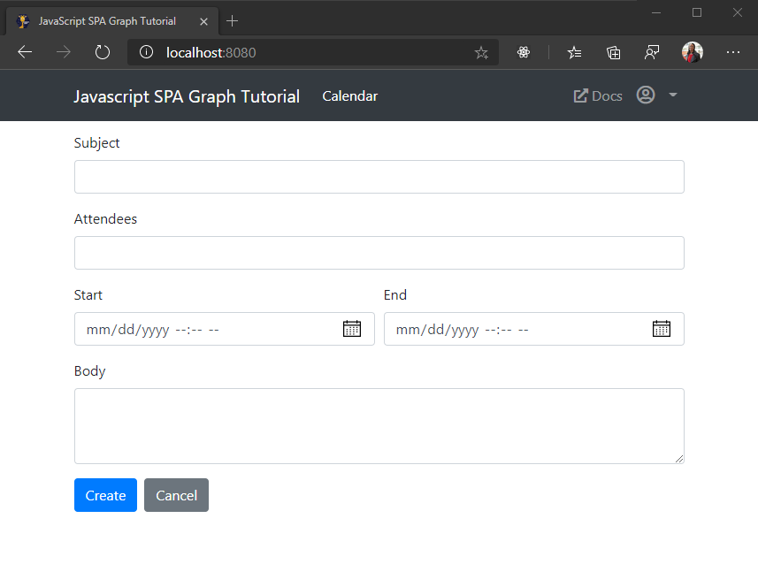

<!-- markdownlint-disable MD002 MD041 -->

In this section you will add the ability to create events on the user's calendar.

## Create a new event form

1. Add the following function to **ui.js** to render a form for the new event.

    :::code language="javascript" source="../demo/graph-tutorial/ui.js" id="showNewEventFormSnippet":::

## Create the event

1. Add the following function to **graph.js** to read the values from the form and create a new event.

    :::code language="javascript" source="../demo/graph-tutorial/graph.js" id="createEventSnippet":::

1. Save your changes and refresh the app. Click the **Calendar** nav item, then click the **Create event** button. Fill in the values and click **Create**. The app returns to the calendar view once the new event is created.

    
